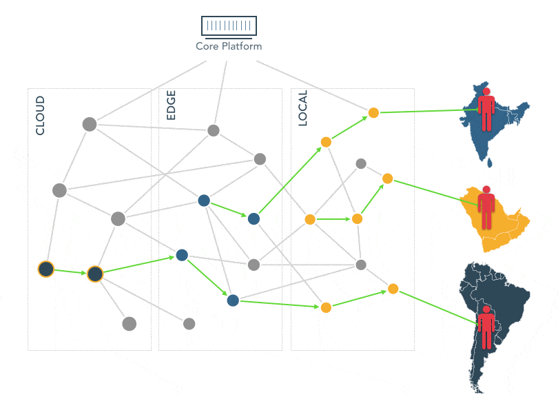

# Hola! 👋

### **Welcome to Uiza, the video streaming as code!** 

We aim to provide developers with an end-to-end video streaming solution that offers simple integration and stable performance at scale. At the very beginning of our roadmap, we tackle the problem that is considered the most severe, _**video and live stream delivery**_. The proximity between the infrastructure and the streamer/viewer is the key factor that influence the quality of the video streams. Setting up and managing a wide network of infrastructures that penetrates locally to reach out as closely as possible to the streamers and viewers in various cities are tough. The first version of our brand-new platform is created to solve this problem.


Our **key differentiation** is that we are developing a diversified network of infrastructures that does not only rely on public cloud like Amazon Web Services, Google Cloud Platform, or Digital Ocean, but also a wide range of local infrastructures those are rooted in lower-tier cities like _Bengaluru, Kolkata, Chennai_... This means your viewers will most likely _watch the videos being streamed from the infrastructure located in the same city of theirs_, which improves the quality and scalability of the video streams significantly.


