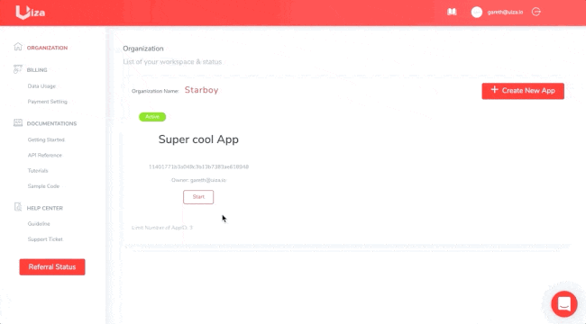
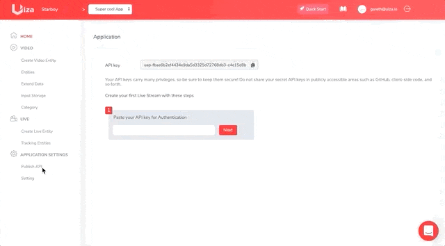

# Authentication

The Uiza API uses basic [HTTP authentication protocol](https://swagger.io/docs/specification/2-0/authentication/basic-authentication/), where an _**API key**_ is required as the _username_ value, to authenticate requests. You do not need to provide any _password_.

Once you sign up, a Uiza application and an API key for this application are created. Go to **Application Settings** ➡**Publish API** to see your default API key.

You can also create multiple API keys and manage them in the [Uiza Dashboard](https://id.uiza.io/).

All API requests _must_ include a valid API key and must be made over HTTPS. Requests that do not comply will fail.

