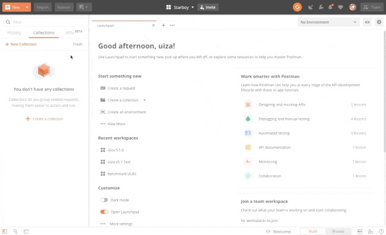

# Postman Collections

In case you prefer to use Postman, follow the following steps to import Uiza's API Collections to your workspace.

1. Download Uiza's API Collection at the bottom of this page.
2. Go to your Postman workspace, click `Import`.
3. Click `Choose Files` and import the `.json` file that you have downloaded.



