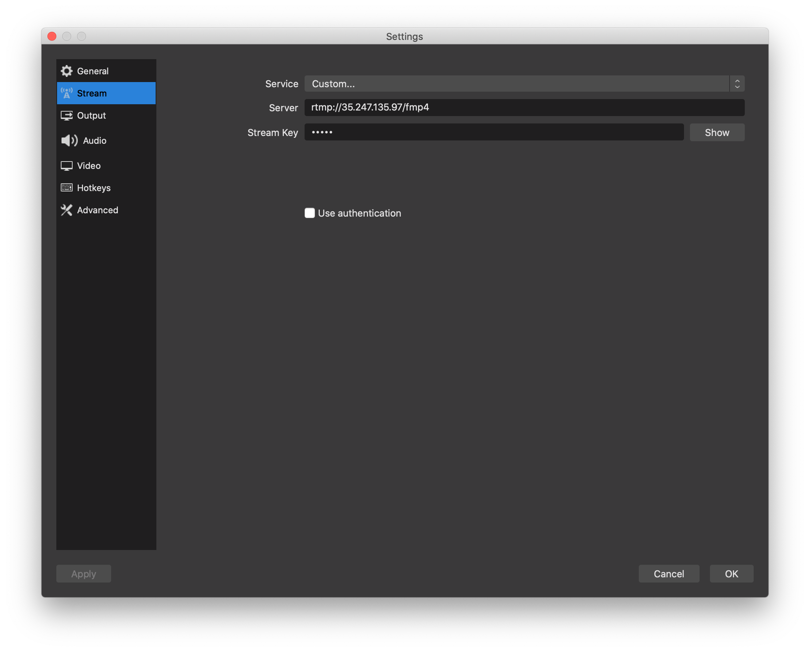

# Live streaming

Our _REST APIs_ use standard _HTTP_ response codes, authentication, and verbs, and return _JSON-encoded responses_. Using these APIs, you will be able to start a live event and stream the content to our network, which will deliver that content to your audiences. Once a live entity is created, Uiza allocates dedicated resources and return an _RTMP_ server to ingest and deliver your stream. The overall framework is articulated in the diagram below.


## **Step 1: Create a live entity**

To start streaming, you need a [`live_entity`](https://docs.uiza.io/api-reference/live-entities) to be created with resources allocated, ready to broadcast the live signal. You could create a live entity by using _**Create a live entity**_ API. 



/v1/live\_entities










The name of your live entity.



Choose the region closest to the location of your streamer.



The description of your live entity.



Set to true to enable and to false to disable video recording. The default value is false.










```
{
 "id": "2b970a39-874a-4d2a-be8a-fd445646d74c",
 "name": "Test Event",
 "description": "Test 1",
 "region": "in-bangalore-1",
 "dvr": false,
 "status": "init",
 "created_at": "2019-10-03T17:34:49Z",
 "updated_at": "2019-10-03T17:34:49Z"
}
```






```go
curl -X POST https://api.uiza.sh/v1/live_entities \
-H 'Authorization: uap-c1ffbff4db954ddcb050c6af0b43ba56-41193b64' \
-d '{"name": "Test Event", "region": "in-bangalore-1", "description": "Test 1"}'
```



Defining your region helps Uiza allocate the resources that are closest to your streamers' locations. This will minimize the risks of network issues. While we are adding more and more regions to our network, here are the currently available regions. 

`in-bangalore-1` \(Bangalore - India\)

`in-mumbai-1` \(Mumbai - India\)


## **Step 2: Retrieve the live entity's information**

You will need the `ingest.key` and `ingest.url` to configure your broadcasting software. These 2 attributes could be retrieved by using the `id` you get in the response in _**Step 1**_ for the _**Retrieve an entity**_ API.


It is important that the value of the **`status`** you get from the response is **`ready`**, meaning that resources have been allocated and ready to ingest and broadcast your live feed. If the **`status`** of your entity is **`init`**, meaning that Uiza is still allocating resources for your entity and your live signal will not be able to be ingested and broadcasted during this process. Please, be patient and keep requesting for the entity's information until you get the **`ready`** status. This process may take up to 1 minute.




/v1/live\_entities/:id










The identifier of the live entity to be retrieved.










```
{
 "id": "2b970a39-874a-4d2a-be8a-fd445646d74c",
 "name": "Test Event",
 "description": "Test 1",
 "ingest": {
   "url": "rtmp://f45dd07a0e-in.uizadev.io/transcode",
   "key": "live_TB62vHgxSY"
 },
 "playback": {
   "hls": "https://f45dd07a0e.uizadev.io/fmp4/22013d8a-d5fa-48f0-9a63-1f471ca9e81d/master.m3u8"
 },
 "region": "in-bangalore-1",
 "status": "ready",
 "dvr": false,
 "broadcast": "offline",
 "created_at": "2019-12-11T02:47:04Z",
 "updated_at": "2019-12-16T02:53:30Z"
}
```






```go
curl -X GET https://api.uiza.sh/v1/live_entities/2b970a39-874a-4d2a-be8a-fd445646d74c \
-H 'Authorization: uap-c1ffbff4db954ddcb050c6af0b43ba56-41193b64' 
```



You could also set up a [webhook](https://docs.uiza.io/api-reference/webhook_endpoints) to be notified automatically when your `live_entity` is ready.


## **Step 3: Configure your broadcasting software and start broadcasting**

Most available broadcasting software uses [RTMP protocol](https://en.wikipedia.org/wiki/Real-Time_Messaging_Protocol) which requires a _server's URL_ and a _Stream Key_ to direct the live signal to the ingest servers. Use the `ingest.url` and `ingest.key` obtained at **Step 2** to configure your broadcasting software in their Settings. The following are the 2 most popular broadcasting software that we strongly recommend.


**OBS \(for desktop\)** - Get it [here](https://obsproject.com/). 





**Streamlabs \(for mobile\)** - Get it [here](https://streamlabs.com/mobile-app).



Once you have configured the `ingest.url` and `ingest.key`, you could start streaming right away.

## **Step 4: Configure the playback link to your player and start watching your live stream!**

The playback links \(`hls` for HLS streaming and `mpd` for MPEG-dash streaming\) of your live entity is the value of `playback` returned in _**Step 2**_**.** With the HLS link obtained, you could play your live stream by these methods: 

1. Configure the HLS link to your Player SDK.
2. Paste the HLS link to Safari and play directly their with Apple's native player.
3. Install the HLS extension and play it on your Chrome browser.

The `mpd` could be player natively [Microsoft Edge](https://www.microsoftedgeinsider.com/en-us/).

By following these _4 steps_, you will be able to live stream your event using Uiza🙏. We understand that this beta version of ours requires quite some amount of manual involvement, but we are working hard to deliver a more delightful experience with more APIs and automation. If you are ready to live-stream your first event, let's move on to the _**API Reference**_.

