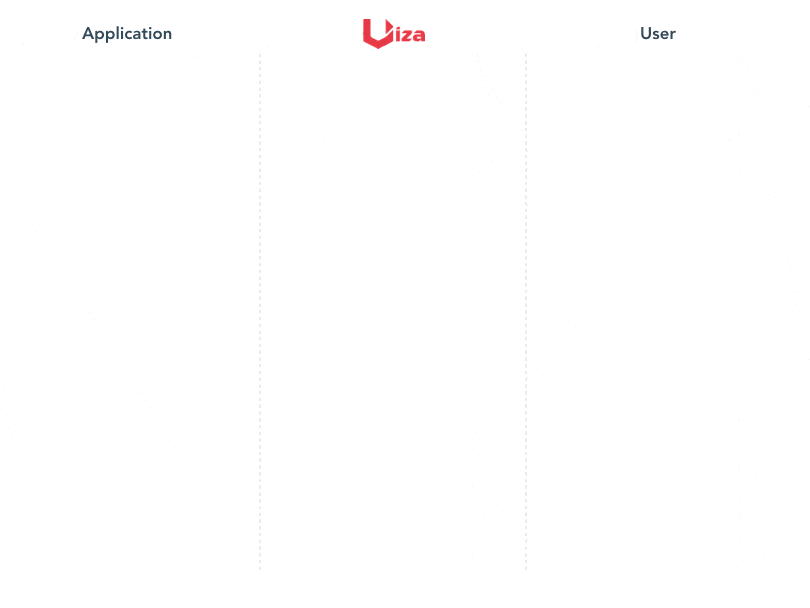

# Video streaming

**Streaming videos** with Uiza is pretty straightforward where the whole process could be summarized in 4 simple steps: 

1. You give us the video,
2. You allow us to publish the video,
3. We let you know when your video is published, and
4. You tell your player to start streaming 🤓 



## Step 1: Create a video entity

To create a [`video_entity`](https://docs.uiza.io/api-reference/video-entities), you need the URL that leads to your original video file. Uiza supports direct HTTP/HTTPS and [FTP](https://en.wikipedia.org/wiki/File_Transfer_Protocol) or [S3](https://aws.amazon.com/s3/) storages. In case the video file is located in your PC, you can upload it to Uiza directly using [Uiza dashboard](https://id.uiza.io/).

Once the `video_entity` is created, Uiza retrieves the video file from the `url` provided in the API request. The ingestion and transcoding of the video automatically starts right after. _The duration of these processes is typically half of the video's duration._



/v1/video\_entities










The name of your video entity.



The URL that redirects Uiza to your video storage. Could be either HTTP, FTP or S3.



Indicates the protocol of your video storage.



Describe the content of your video. Often useful for displaying to viewers.



A shortened version of your description.



The URL of the video entity's poster image



The URL of the video entity's thumbnail image.










```
{
 "id": "f42b4ac3-869e-4010-8e21-042e40be7655",
 "name": "Sample Demo-Video",
 "description": "Lorem ipsum dolor sit amet, vis odio oratio scripserit ut",
 "short_description": "Duo ad graeci principes, legimus mnesarchum scribentur ut pro",
 "view": 1000,
 "poster": "Lorem ipsum dolor",
 "thumbnail": "Lorem ipsum dolor",
 "type": "VOD",
 "duration": 11213,
 "publish_to_cdn": "queue",
 "created_at": "2019-12-11T02:47:04Z",
 "updated_at": "2019-12-11T02:47:04Z"
}
```






```text
curl -X POST https://api.uiza.sh/v1/video_entities 
     -H 'Authorization: uap-c1ffbff4db954ddcb050c6af0b43ba56-41193b64' 
     -d '{"name":"Sample Demo-Video", "description":"Lorem ipsum dolor sit amet, vis odio oratio scripserit ut","short_description":"Duo ad graeci principes, legimus mnesarchum scribentur ut pro","view":1000,"poster":"Lorem ipsum dolor","thumbnail":"Lorem ipsum dolor","type":"VOD","duration":11213,"publish_to_cdn":"queue"}'
```


## Step 2: Publish the video entity

The renditions of your video, as the output of transcoding, will be distributed to Uiza's [Content Delivery Network](https://en.wikipedia.org/wiki/Content_delivery_network) \(CDN\) through which it is delivered to viewers. To let Uiza know that you are ready to publish your video to your viewers, use the _**Publish a video entity**_ API to request for video publishing.



/v1/video\_entities/:id/publish










The identifier of the video entity to be published.










```
{
 "message": "Video entity started to publish successfully"
}
```






```text
curl -X POST https://api.uiza.sh/v1/video_entities/f42b4ac3-869e-4010-8e21-042e40be7655/publish 
     -H 'Accept: */*' 
     -H 'Authorization: uap-c1ffbff4db954ddcb050c6af0b43ba56-41193b64' 
     -H 'Cache-Control: no-cache' 
     -H 'Connection: keep-alive'
```


## Step 3: Retrieve the video entity's information

The process of transferring the renditions of your video to Uiza's CDN takes time. You player can only start playing the video after it has been successfully published. To keep track of this process, retrieve the video entity's information. The `publish_to_cdn` argument indicates the publishing status of your video entity. If the value is `ready`, you are good to go.



/v1/video\_entities/:id










The identifier of the video entity to be retrieved.










```
{
 "id": "f42b4ac3-869e-4010-8e21-042e40be7655",
 "name": "Sample Demo-Video",
 "description": "Lorem ipsum dolor sit amet, vis odio oratio scripserit ut",
 "short_description": "Duo ad graeci principes, legimus mnesarchum scribentur ut pro",
 "view": 1000,
 "poster": "Lorem ipsum dolor",
 "thumbnail": "Lorem ipsum dolor",
 "type": "VOD",
 "duration": 11213,
 "publish_to_cdn": "queue",
 "created_at": "2019-12-11T02:47:04Z",
 "updated_at": "2019-12-11T02:47:04Z"
}
```






```text
curl -X GET https://api.uiza.sh/v1/live_entities/22013d8a-d5fa-48f0-9a63-1f471ca9e81d 
     -H 'Accept: */*' 
     -H 'Accept-Encoding: gzip, deflate' 
     -H 'Authorization: uap-c1ffbff4db954ddcb050c6af0b43ba56-41193b64' 
     -H 'Cache-Control: no-cache' 
     -H 'Connection: keep-alive'
```


## Step 4: **Configure the playback link to your player and start streaming!**

Three playback links are returned in the response of Step 3. These playback links represent the 3 streaming protocols that Uiza currently supports:

* `hls` for HLS fMP4 streaming,
* `hls_ts` for HLS ts streaming, and
* `mpd` for MPEG-dash streaming.

Configure these playback links to your player will enable your player to get the video chunks from Uiza's CDN, decode and display them to your viewers. And that is How to stream your first video with Uiza in 4 simple steps. 😉

