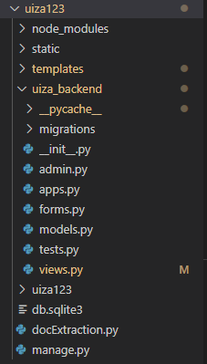
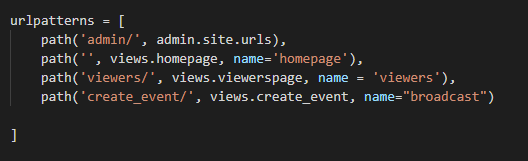

# Python Live Streaming App

Uiza provides intuitive APIs, which simplifies the integration of live streaming functionality into your platform. This guide is a step-by-step tutorial on how to build your live streaming app with Uiza’s APIs. The web app will have two components: the broadcaster web app, to start a stream, and the viewer app, to list all broadcasts and playback the broadcast.

## Components of our live streaming app

Sample code is provided below on how to build a simple web app to call on Uiza’s API. The language used for web app is Python.

#### Uiza Streaming Concept

To understand the flow of the this tutorial, following terminologies are explained by the graph below. 


During this documentation, broadcast, live streaming and streaming will be usede interchangeably.

#### Building a Live streaming Web App with Uiza

To have a live streaming app, we have to distinguish between a broadcaster and a viewer. A broadcaster streams the live stream and a viewer watches the live stream - this is a one way interaction channel, hence we have to build 2 separate pages: a broadcasting page and a viewer page. Tha broadcaster needs to start a broadcast through a stream URL and key, while the viewer sees the active live streams and can watch them through the web app.

## Building the live streaming app

### Prerequisites

Install following dependencies in terminal

### Step 1. Creating a new Project and install dependencies

#### Dependencies

`pip install python` 

`pip install django` 

`pip install json`

To build a broadcast web app, we start with creating a new python project.

#### Creating a new Project

1. Open your favorite editor
2. Open the terminal 
3. Type: django-admin createproject \(this makes a directory with your project name\) in the terminal
4. Go to your project directory `cd project name`
5. To create your app, type: `django-admin createApp <AppName>`\(this creates an app inside your project\)
6. Create a templates folder in which your html files will be held.Templates folder will be in project folder.

   

   your project directory structure should look like this  

   **Don't worry about the project and app name, as any name will work.**

7. Open `setting.py` and add the app name to the installed apps list. Also add templates path to templates dir.


#### Setting up the templates folder

Create 4 html files in templates folder: 

1. `base.html` 
2. `homepage.html` 
3. `viewspage.html` 
4. `broadcastpage.html`

For now leave these empty.

#### Django connects and renders:

We will define some urls in the `urls.py` file in project directory. There we write the view name, which performs some functions and renders a html file.

`url eg: path('viewers/', views.viewerspage, name = 'viewers')` so here 'viewers/' is the url that will be added to localhost, views.viewerspage is name of views which will perform some functions on this url and name = 'viewers' is used to redirect to another view from html file after submission which we will use later.

###  Step 2. Setting up the URLS

You must have noticed the `urls.py` file in the project directory. Lets open it and see what it does. In the file we see some imports and a list named url patterns. As discussed we need to connect urls and views, so we will import views to `urls.py` file

`from app name import views`

We will make some urls in url patterns list like this.  



`admin/` was defined already, that is the default url provided by Django and Django is known for this feature of providing an admin portal which keeps all the database of your website. But let's take example of `viewers/` url. Lets divide this into 3 parts: url, view, and name

**URL** - what URL should appear at the URL bar 

**View** - what view to call when user puts this URL in the URL bar.

**Name** - this is name of url which we will use when talking about templates to redirect to             other urls from html pages.\(don't worry if it is not clear now\)

```text
now we will make some urls in url patterns list like this.


so 'admin/' was defined already, that is the default url provided by django and django is known for this feature of providing an admin portal which keeps all the database of your website.
But let's take example of 'viewers/' url.
so lets divide this into 3 parts url,view,name
**Url** - what url should appear at the url bar 
**View** - what view to call when user puts this url in        the url bar.
**Name** - this is name of url which we will use when           talking about templates to redirect to             other urls from html pages.(don't worry if it is not clear now)

## Step 2. Setting up authorization


We need an API key to access Uiza's services. The URL to access the services will be the same, so we're saving it as a constant. The default headers will be common for every API call.

To get your API key, create an account at Uiza here: [Sign Up Link](https://id.uiza.io/register). Once you are in the developer console, you will see your API key.

Following code shows the constants:
```python=
Authorization_key = "<<Your API key>>"
url = 'https://development-api.uizadev.io/v1/live_entities'
```

### Step 2. Setting up authorization

We need an API key to access Uiza's services. The URL to access the services will be the same, so we're saving it as a constant. The default headers will be common for every API call.

To get your API key, create an account at Uiza here: [Sign Up Link](https://id.uiza.io/register). Once you are in the developer console, you will see your API key.

Following code shows the constants:

```python
Authorization_key = "<<Your API key>>"
url = 'https://development-api.uizadev.io/v1/live_entities'
```

#### Paging and navigation.

We divide the app into two parts: 

1. Broadcast Page: Will contain the functionality to create a new broadcast.
2. View Page: This will display all broadcasts currently in the system, with online broadcasts as a green tile and offline broadcasts as an orange-red.

### Step 3. Building the Broadcast Page

Let us start with the broadcast page design.

#### Creating default states

We use global variables that can be displayed in the application, and manipulated at run-time.

```python
stream_key = ''
stream_url = ''
stream_hls = ''
NotPlayable = True
```

#### Define a view to start a broadcast

**Note:** a function in python is called a view in Django. The below structure contains all the information of the HTTP request.

As you can see, we make use of the `region` state to set the region to a supported value.

We will create an Entity using the `POST` method:

So what below view does?

First, it checks if the request method is a POST method. If it is not, then a simple html page is rendered.

Otherwise, the if condition is triggered and the POST method will be called after the submit button of form is clicked, which we will see in the html file.

Then we make a POST request using the parameters and get back a json response from the Uiza API

The parameter are defined in Uiza's API documentation.

```python
#when broadcast button is click post method is triggered

def create_event(request):
    if request.method == "POST":
        region = request.POST['region']

        # necessary headers and data for the post request 
        headers = {'Authorization': Authorization_key ,
                'Content-Type': 'application/json',
                'cache-control': 'no-cache' }   
        data = {
                "name":"Demo",
                "region":region,
                "description":"AFF CUP"
                }
        #post request for the id of live stream    
        response = requests.post(url = url, headers = headers, params= data)
        print(response.text)
        #convert the response to json
        live_response = json.loads(response.text)
        #retrieved id from json
        created_id = live_response["id"]
```

Using the retrieved entity, we call the 'GET' method with `id` as value. The authorization header expects your API key.

```python
# Now make the get request using the headers and using the id retrieve the     stream_key,stream_url and playback
get_headers = {
    'Accept': '*/*',
    'Accept-Encoding': 'gzip, deflate',
    'Authorization': Authorization_key,
    'Cache-Control': 'no-cache',
    'Connection': 'keep-alive'
}

newUrl = url+'/' + created_id
```

Now let's create the polling call structure. This loop will run until the 'status' returned is 'ready'. As soon as the status becomes 'ready', the global variables for `stream_url`, `stream_key`, and `stream_hls` are retrieved from the GET request.

```python
        #This while loop will make the get request from the uiza UPI till the status is     not ready and retrieve the necessary info and then will render the homepage
        while True:
            retrieve_entity = requests.get(url = newUrl, headers=get_headers)
            retrieve_entity_json = json.loads(retrieve_entity.text)
            status = retrieve_entity_json["status"]
            print(status)
            print(i)
            if status == "ready":
                print(retrieve_entity_json)
                global stream_url
                stream_url = retrieve_entity_json["ingest"]["url"]
                global stream_key
                stream_key = retrieve_entity_json["ingest"]["key"]
                global stream_hls
                stream_hls = retrieve_entity_json['playback']['hls']
                global NotPlayable
                NotPlayable = False

                return render(request,'homepage.html')
return render(request,'broadcastpage.html') #This render will be called if post request is not made.
```

Now we go to our html pages which we created earlier:

### Step 4. Building the broadcast page UI

We build a very simple user interface. The front page will have a drop-down menu to select the regions. This drop-down contains the following regions \(you can find the available regions here: [Regions](https://starboy.gitbook.io/uiza-doc/getting-started/regions)\):

* in-bangalore-1
* in-mumbai-1

We create a `Start broadcast` button to call the `start_broadcast` function. The three lines below are important. They leverage the state value to display current states.

Now what does this html page do?

It uses some html tags and Django template tagging. Template tagging is used to insert logic into html. Basically this implements a html form and a Javascript polling function. Now have a look at `action` in form. This is a template tag which tells when form is submitted, then goes to a url whose name is broadcast. Remember we gave names to url paths in the `urls.py` file. Under that you will see csrf token which is cross-site request forgery used with forms always.

Now button tag contains value="submit". This means the value selected by user from the drop down will be attached with submit button so that we can use that value in views.

Polling function is just to give animation, so that when broadcast button is clicked, `Polling...` starts till we get response from the Uiza API. Consider it as loading of another html page.

Also consider: `` . This inherits all the html tags from `base.html` . Writing of repetitive html code for every page is prevented with this; the uniformity of the code is maintained as well.

Everything inside

```markup


```

is unique to this html file.

```markup

<!-- form for the broadcasting page which lets user to select the region and start broadcasting -->

<h1>UIZA GUIDE</h1>
<div style="align-content:left;float:left;width:'45%';margin:'10px';height:'220px';padding:'10px'; border:'1px solid red'"></div>
<!-- the template tag in action will take us to create_event view because in urls.py the views name is broadcast -->
<!-- onsubmit of form StartPolling js function is called -->
<form action=""  method="POST" onSubmit="StartPolling();">
    
    <p> Start broadcast <br /><p>
        <label>Pick your region: &nbsp;
                <select name="region" id="region">
                    <option value="in-bangalore-1">in-bangalore-1</option>
                    <option value="in-mumbai-1">in-mumbai-1</option>
                  </select>
                </label> &nbsp;
                <!-- after submission the selected value from the dropdown will go to the create event view -->
              <button  type="submit" value="select" >Start broadcast</button> <br />
              <span id="wait"></span>
            </form>              
            <!-- this js function will play as loading screen until we get the response of our request from the API  -->
              <script>
                  function StartPolling() {
                  setInterval(function Polling() {

                  var wait = document.getElementById("wait");
                  if(wait.innerHTML.length==0)
                    wait.innerHTML = "Polling";
                  if ( wait.innerHTML.length > 10 ) 
                    wait.innerHTML = "Polling";
                  else 
                    wait.innerHTML += ".";
                  }, 1000);
                  }

              </script>
    </p>

</div>
</div> 

```

### Step 5. Building the View Page

The view page contains tiles that correspond to available streams.

This view will render simple html page when `NotPlayable` is false; when true, it will send the list of responses to `viewerspage.html`in a context dictionary.

Context dictionary is just the information passed to the html page from the view.

```python
def viewerspage(request):
    # if broadcast button is not clicked then this view is rendered
    if NotPlayable: 
        print('got here')
        list_of_videos = []
        return render(request,'viewerspage.html')
    else:    
        # if broadcast button is clicked then this view is rendered and a context         dictionary is passed with stream_key, stream_url, playback link

        stream_dict=    {'stream_key':stream_key,'stream_url':stream_url,'playback':stream_hls}
        list_of_videos.append(stream_dict)
    #The last parameter of render is the context dictionary, these are the variables     which store useful info that we would want to use in out templates
    return render(request,'viewerspage.html',{'list_of_videos':list_of_videos})
```

#### Rendering the view page html

We create a dynamic list of VideoTiles, and populate it on every render\(\). We use a 5-second interval between each render, to not overdo it. Then we access the details from the properties of the Video at the time of creation. We use the properties to pass values to the inner components of the tile and make it look functional.

For example: `{this.props._url}` accesses the `_url` parameter from `<VideoTile>` The same approach is used for the key and the playback URL.

The tile has to be clickable and take the viewer to the live stream. For that, we make use of routing in our application and send the user to a page with video playback url. The playback page is dynamically generated and plays the video.

```javascript
<a href={"./video/" + this.props._playback_url.replace(/(^\w+:|^)\/\//, '')}>
```

Following code shows the VideoTile component:

In this html we inherit from base.html, then we go to our body block and apply a for loop, which will give us 3 keys, and we need the playback key's url that we have put into the video tag which plays the video on click.

In the following code block we inherit from base.html. The body block contains a for loop, which gives us 3 keys; the playback key's URL from the video tag is needed, to play the video on click.

```markup


<h1>UIZA ONLINE VIDEOS</h1>

     <!-- the list of videos got by the context dictionary will be displayed here with stream url, stream key and playback  -->
      

    <div class = 'tileContainer' style="width: 240px; height: 200px;float: left; margin: 10px; padding: 8px; display: flex; flex-Direction: column;
    word-Wrap: break-word; font-Size: 16px; border: 2px solid white; background-Color:Tomato;">    
      

      <!-- play the video when playback link is found else just print the link in the video tile -->
      
        <video src="key" type="application/x-mpegURL"></video>
      
      <p><a href="{{value}}">{{key}}</a></p>
      

      </div>
    
    

```

## Conclusion

That's how you can integrate live streaming into your app using Uiza's APIs. With just two API methods, you will have your stream key and stream URL to start a live stream. If you have any questions please check out our Github repo where this entire project has been uploaded with source code [here](https://github.com/info3g/python-uiza) and if you have any other questions please contact us here: [anhnh@uiza.io](mailto:anhnh@uiza.io)

